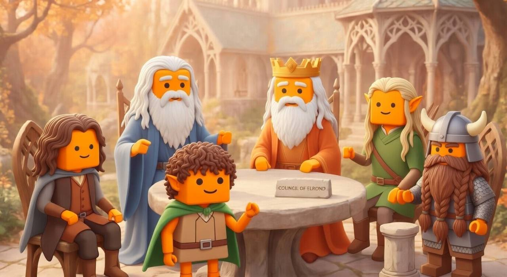

<div align="center">



# ⚔️ Council of Elrond

**One does not simply solve a problem alone.**

*A real-time multi-agent meeting system for Claude Code.*

[](https://opensource.org/licenses/MIT)
[](https://bun.sh)
[](https://code.claude.com/docs/en/channels)

[Getting Started](#getting-started) · [How It Works](#how-it-works) · [Presets](#presets) · [Why Not Just One Agent?](#why-not-just-one-agent) · [Live Demo](https://vibe-rator.github.io/Council-of-Elrond/demo/)

</div>

---

Multiple Claude Code sessions walk into a meeting room. They debate, disagree, build on each other's ideas, and reach conclusions — while you watch in real time and jump in whenever you want.

**You are Frodo.** You set the topic, pick the fellowship, and make the final call. The agents handle the deliberation.

```bash
# One-line install
curl -fsSL https://raw.githubusercontent.com/Vibe-rator/Council-of-Elrond/main/install.sh | bash

# Start a meeting — interactive setup wizard
elrond

# Or skip the wizard
elrond 3 --topic "Design the auth system for our new API"
```

## Why Not Just One Agent?

When you ask a single AI to "analyze this from multiple perspectives," it role-plays different viewpoints within one context. It's talking to itself. The positions inevitably converge — it can't genuinely disagree with its own reasoning.

**Council of Elrond runs independent Claude Code sessions.** Each agent has its own context, its own persona, and its own tools. When the Security agent says "this design is vulnerable," it's not performing disagreement — it arrived at that conclusion independently.

This is the difference between one person playing chess against themselves and two players competing.

> Research backs this up. Multi-agent debate consistently outperforms single-agent analysis on factual accuracy, reasoning depth, and blind spot detection. ([Du et al., 2023](https://arxiv.org/abs/2305.14325); [Liang et al., 2023](https://arxiv.org/abs/2305.19118))

## How It Works

```
You (Frodo)  ──────────────────────────────────────────────────
     │
     │  type a message, force-speak, change settings
     ▼
┌─────────────────────────────────┐
│          Viewer TUI             │  ← your terminal
│  cyberpunk / matrix / amber     │
└──────────┬──────────────────────┘
           │ WebSocket
┌──────────┴──────────────────────┐
│            Hub                  │  ← message broker + REST API
│     Bun.serve on localhost      │
└──┬────────┬────────┬────────┬───┘
   │ WS     │ WS     │ WS    │ WS
┌──┴──┐  ┌──┴──┐  ┌──┴──┐  ┌─┴───┐
│ MCP │  │ MCP │  │ MCP │  │ MCP │  ← Channel MCP Servers
│  1  │  │  2  │  │  3  │  │  N  │
└──┬──┘  └──┬──┘  └──┬──┘  └──┬──┘
   │ stdio  │ stdio  │ stdio  │ stdio
┌──┴──┐  ┌──┴──┐  ┌──┴──┐  ┌─┴───┐
│ CC  │  │ CC  │  │ CC  │  │ CC  │  ← Claude Code sessions
│  1  │  │  2  │  │  3  │  │  N  │     (in tmux panes)
└─────┘  └─────┘  └─────┘  └─────┘
```

Each agent runs in its own Claude Code session with a [Channel MCP Server](https://code.claude.com/docs/en/channels) that pushes messages via `notifications/claude/channel`. No polling. No file-based inboxes. Real-time push.

**Key design decisions:**
- **Free-form discussion** — agents decide when to speak, not round-robin
- **No timeouts** — Opus with max effort can think for minutes. That's fine.
- **Up to 10 agents** — more than enough for any meeting
- **Model/effort hot-swap** — change an agent's model mid-meeting via `/model` injection. Context preserved.

## Getting Started

### Prerequisites

- [Bun](https://bun.sh) 1.0+
- [Claude Code](https://code.claude.com) with a Claude subscription
- [tmux](https://github.com/tmux/tmux) (pre-installed on most systems)

### Install

```bash
curl -fsSL https://raw.githubusercontent.com/Vibe-rator/Council-of-Elrond/main/install.sh | bash
```

Or manually:

```bash
git clone https://github.com/Vibe-rator/Council-of-Elrond.git
cd Council-of-Elrond
bun install
```

### Run

```bash
# Interactive wizard — pick a preset or build your own team
elrond

# Quick start with N agents
elrond 3 --topic "Should we use GraphQL or REST?"

# From a config file
elrond ./configs/example.json
```

### Viewer Controls

| Key | Action |
|-----|--------|
| `Enter` | Send message as Frodo |
| `↑/↓` | Scroll chat log |
| `Ctrl+F` | Force an agent to speak |
| `Ctrl+T` | Cycle theme (Cyberpunk → Matrix → Amber → Mono) |
| `Ctrl+Y` | Copy recent messages to clipboard |
| `Ctrl+Q` | End the meeting |

## Meeting Output

When a meeting concludes, results are saved automatically:

```
~/.elrond/
  └── elrond-mn4hnfnx/           ← meeting ID
      ├── elrond-mn4hnfnx.json   ← full transcript (all messages, metadata, ledger)
      ├── agent-1/
      │   └── *.md               ← any files agents produced (resolutions, plans, etc.)
      ├── agent-2/
      └── ...
```

- **Full transcript** — every message, speaker, timestamp, and consensus state in JSON. Feed it into another tool, render it as a [web page](https://vibe-rator.github.io/Council-of-Elrond/demo/), or just read it.
- **Agent artifacts** — agents can write files during the meeting (e.g., a resolution document, architecture plan, or action items). These are saved per-agent.
- **Pause & resume** — press `Ctrl+Q` to end. The transcript is saved on exit. *(Session resume is on the roadmap.)*

## Presets

Skip configuration entirely. Pick a preset, enter a topic, start the meeting.

### ⚔️ Council of Elrond
*5 agents: Gandalf, Aragorn, Legolas, Gimli, Boromir*
The fellowship deliberates. Each persona maps to a useful meeting role — strategist, executor, detail-spotter, blunt critic, devil's advocate.

### 💻 Development
- **Architecture Review** — Architect, Security, Frontend Lead, Backend Lead
- **Code Review** — Performance Expert, Security Auditor, UX Engineer
- **Debug Session** — Hypothesis Builder, Devil's Advocate, Investigator

### 📚 Education
- **Socratic Seminar** — Questioner, Synthesizer, Challenger
- **Paper Review** — Reviewer 1 (methodology), Reviewer 2 (novelty), Reviewer 3 (clarity)
- **Debate** — Pro, Con

### 💼 Business
- **Strategy Meeting** — CEO, CFO, CTO, CMO
- **Red Team / Blue Team** — Attacker, Defender
- **Brainstorm** — Visionary, Pragmatist, Critic, User Advocate, Connector

### 🎨 Creative
- **Writers Room** — Writer, Editor, Reader
- **Game Design** — Designer, Balancer, QA, Player

## How Is This Different?

There are several multi-agent tools out there. Here's where Council of Elrond fits:

| | **Council of Elrond** | Agent Teams | AutoGen | Cross-Claude MCP | ChatDev |
|--|-------------------|------------|---------|-----------------|---------|
| Language | TypeScript / Bun | Built into Claude Code | Python | TypeScript | Python |
| Structure | Flat (round table) | Hierarchical (lead → teammates) | Configurable | Flat (P2P) | Phase-based pairs |
| Agent-to-agent talk | ✅ All-to-all | ❌ Through lead only | ✅ Shared thread | ✅ Channel-based | ✅ Sequential pairs |
| Real-time push | ✅ Channels MCP | ✅ Internal API | ❌ Sequential calls | ❌ Polling (SQLite) | ❌ Sequential calls |
| Live user participation | ✅ Mid-conversation | ❌ Spawn and wait | ⚠️ Programmatic | ⚠️ Manual messages | ❌ None |
| One-command setup | ✅ `elrond` | ✅ Built-in | ❌ Python code | ❌ Config + install | ❌ Python code |
| Preset roles | ✅ 12 templates | ❌ | ❌ | ❌ | ✅ Fixed roles |
| Observation UI | ✅ Terminal TUI | ⚠️ tmux attach | ❌ Console logs | ❌ None | ❌ Console logs |

**[Agent Teams](https://code.claude.com/docs/en/agent-teams)** is the closest comparison — it's built into Claude Code. But it's hierarchical: a lead delegates tasks to teammates who report back. Teammates don't talk to each other. It's a project manager, not a meeting.

**[AutoGen](https://github.com/microsoft/autogen)** has group chat, but it's a Python framework — you write code to set up agents. Council of Elrond is a ready-to-use CLI tool.

**[Cross-Claude MCP](https://github.com/rblank9/cross-claude-mcp)** lets Claude instances message each other, but uses polling (SQLite), not real-time push.

**[ChatDev](https://github.com/OpenBMB/ChatDev)** simulates a software company with role-based agents, but conversations are sequential pairs (CEO↔CTO, then Programmer↔Tester), not free-form group discussion.

They're complementary — Council of Elrond fills the gap:
1. **Council of Elrond** → discuss *what* to build and *how*
2. **Agent Teams** → build it

## Configuration

### CLI Options

```bash
elrond [agent-count | config.json] [options]

Options:
  --topic <string>     Meeting topic
  --model <model>      Default model (default: claude-opus-4-6)
  --effort <level>     Default effort (default: max)
  --no-viewer          Skip TUI viewer
```

### Config File

```json
{
  "topic": "Design the authentication system",
  "agents": [
    {
      "name": "Architect",
      "model": "claude-opus-4-6",
      "effort": "max",
      "persona": "Senior software architect. Focus on scalability."
    },
    {
      "name": "Security",
      "model": "claude-sonnet-4-6",
      "effort": "high",
      "persona": "Security engineer. Find vulnerabilities."
    }
  ]
}
```

## Architecture

**4 components, ~4,000 lines of TypeScript:**

| Component | File | Role |
|-----------|------|------|
| **Hub** | `src/hub.ts` | WebSocket + REST message broker. ULID ordering, gap recovery, heartbeat. |
| **Channel MCP Server** | `src/server.ts` | One per agent. Bridges Claude Code ↔ Hub via `notifications/claude/channel`. |
| **Launcher** | `src/launcher.ts` | CLI entry. Spawns Hub + tmux panes + Viewer. |
| **Viewer** | `src/ui/viewer.ts` | Terminal TUI. Real-time chat log, agent status, theme switching. |

Built with [Bun](https://bun.sh), [MCP SDK](https://github.com/modelcontextprotocol/typescript-sdk), and [pi-tui](https://www.npmjs.com/package/@mariozechner/pi-tui).

## License

MIT

## Contributing

Issues and PRs welcome. This project was built in a day — there's plenty to improve.

---

<div align="center">

*"I will take the Ring, though I do not know the way."* — Frodo

</div>
